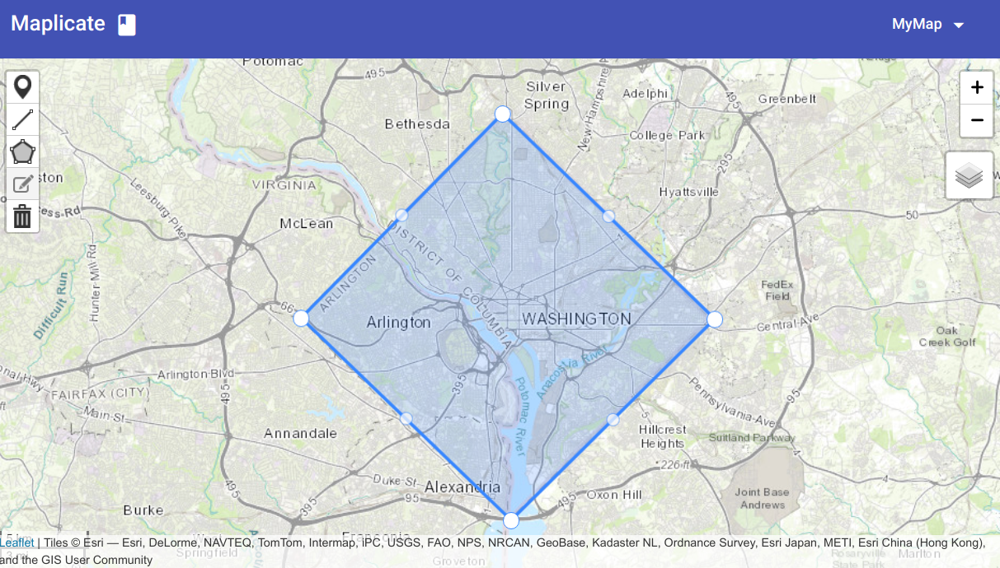

# Maplicate

[](https://travis-ci.org/Maplicate/maplicate-editor)

Maplicate is a collaborative mapping tool based on a peer-to-peer network. It allows users to create and edit features on a shared map, without using a central server to host the data. The data synchronization is on a peer-to-peer network, which means

- each participant is directly connected to the others
- each participant receives updates in real-time
- each participant owns a complete copy of map



This tool is totally experimental and currently under massive development. It changes and breaks :-)

## Implementation

Maplicate is built with three layers:

- a map view that provides map feature visualization and editing
- a data store that manages data update and synchronization
- a p2e network where data is transmitted

The three layers are developed in an application using [Angular](https://angular.io) and [Angular Material](https://material.angular.io/).

### Map View

The map view is created with [Leaflet](https://leafletjs.com/), a mapping library with full features and rich plugin ecosystem. We use [leaflet.pm](https://github.com/codeofsumit/leaflet.pm/issues) to provide map feature editing and leverage its abundant map events for data store update.

### Data Store

[OrbitDB](https://github.com/orbitdb/orbit-db) servers as a data management service. Each map feature is stored in an in-memory key-value store with a unique id and a content hash.

At one end, it receives map feature update notifications (with data) from the map view, save map features in the data store, and emit the update across the p2p network.

At the other end, it listens data replication event from the p2e network, update its data store with the map features from other peers, and sends update notification to the map view.

### P2P Network

Under the hook, [IPFS](https://ipfs.io/) is used to keep peers connected and synchronize data among connected peers.

## Development

Setup the project locally:

```bash
$ npm install
$ npm run start
```

then checkout the app at `localhost:4200` and play!

## License

MIT @ 2018
